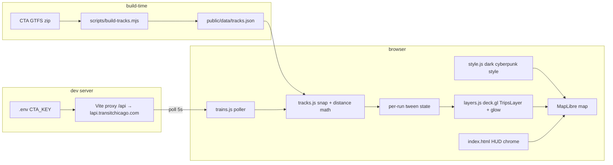

# feat: CHI-TRON — Real-Time Cyberpunk Map of the Chicago L

**Target repo:** `~/Projects/active/chi-tron` (new; created by U1). All paths below are relative to it. On approval, this plan is copied to `docs/plans/2026-07-28-001-feat-chi-tron-mvp-plan.md` in the new repo as the canonical artifact.

---

## Summary

A local-MVP web app: real-time 3D map of the Chicago L with trains rendered as Tron-style light cycles — glowing heads pulling fading neon trails over a dark Blade Runner / Edgerunners city. Built free-only (no paid services, no accounts), designed for an autonomous build run, verified in the browser at every milestone. Precedent: Mini Tokyo 3D.

## Problem Frame

Jojo wants a design-taste showcase piece (passion lane — explicitly not a Portfolio Doctrine flagship) and a test of autonomous-build capability. Deliverable: a running local app he can open, watch real trains glide across, and screenshot. Deploy is a later session.

## Requirements

- **R1** — Live train positions for all 8 L lines from the CTA Train Tracker API, refreshed ~every 5s.
- **R2** — Trains move continuously along real track geometry (no teleporting between GPS pings).
- **R3** — Tron aesthetic: dark 3D city, neon per-line colors, fading light trails, glowing train heads.
- **R4** — Everything free: no paid tiles, services, or accounts. CTA API key stays out of git and out of the client bundle.
- **R5** — Mock mode (`?mock=1`) renders synthetic trains on real tracks — app is demoable and verifiable without the key, network, or active service.
- **R6** — HUD chrome: CHI-TRON wordmark, live clock, per-line legend toggles, scanline/vignette overlay, and the line "Unofficial fan project — not affiliated with CTA" (license requirement).
- **R7** — Runs locally via one command (`npm run dev`) after a one-time track-data build step.

### Scope Boundaries

**Deferred to follow-up work:** deploy (GitHub Pages + key-proxy worker), Bus Tracker layer, Metra/Divvy/flight layers, sound design, idle-camera cinematics beyond a basic orbit.
**Out of scope:** accounts/auth, mobile optimization, historical playback.

---

## Key Technical Decisions

- **KTD1 — Vanilla JS + Vite, no framework.** *(session-settled: user-directed — autonomous run favors fewest moving parts; UI is one HUD overlay, not component-heavy.)*
- **KTD2 — MapLibre GL JS for basemap/camera/buildings + deck.gl `MapboxOverlay` (interleaved) for train layers.** deck.gl's `TripsLayer` is purpose-built for the fading-trail effect. Chosen over Three.js-from-scratch (weeks of work) and pure MapLibre (no trail primitive).
- **KTD3 — OpenFreeMap vector tiles + fully custom dark style JSON.** Keyless and free; gives total control of colors and `fill-extrusion` 3D buildings — the design-taste lever. CARTO dark-matter style is the documented fallback if OpenFreeMap is down (verified both keyless).
- **KTD4 — Snap-and-tween motion model.** Trains keyed by CTA run number; each API snapshot snaps to the line's track polyline → target distance-along-track; render loop eases displayed distance toward target over the poll interval. Chosen over raw GPS dots (teleporting, off-track jitter). This is the core engineering trick (R2).
- **KTD5 — API key server-side only.** Key lives in `.env` (gitignored) as `CTA_KEY` (no `VITE_` prefix, so Vite never bundles it); `vite.config.js` dev proxy rewrites `/api/*` → `lapi.transitchicago.com` and appends the key. Also solves the CTA API's missing CORS headers.
- **KTD6 — Local MVP only.** *(session-settled: user-directed — chosen over build+deploy; deploy needs a Cloudflare/Vercel account and is a follow-up session.)*
- **KTD7 — Location `~/Projects/active/chi-tron`.** Matches the existing convention (`active/` holds real projects); user said `~/Projects`, adjusted one level down.

### Verified External Facts (researched 2026-07-28)

- `https://lapi.transitchicago.com/api/1.0/ttpositions.aspx?key=KEY&rt=red,blue,brn,g,org,p,pink,y&outputType=JSON` → per-train `lat`, `lon`, `heading`, run number, next station. 100k calls/day limit; 5s polling ≈ 17k/day.
- CTA static GTFS: `https://www.transitchicago.com/downloads/sch_data/google_transit.zip`, includes `shapes.txt` track geometry.
- OpenFreeMap: `https://tiles.openfreemap.org/planet`, no key, `building` source-layer carries `render_height`/`render_min_height` for extrusions.

---

## High-Level Technical Design



Train state machine per run number: `new → tracking (snap, tween) → stale (no report 2 polls, fade out) → removed`. Each train keeps a timestamped trail buffer (last ~60s of interpolated positions) feeding `TripsLayer.currentTime`/`trailLength`.

## Output Structure

```
chi-tron/
├── .env                      # CTA_KEY=... (gitignored, user pastes at kickoff)
├── .gitignore                # .env, node_modules, dist
├── README.md                 # what/why, setup, stretch layers, CTA disclaimer
├── vite.config.js            # /api proxy + key injection (KTD5)
├── index.html                # HUD chrome, scanline/vignette CSS
├── docs/plans/               # this plan (canonical copy)
├── scripts/build-tracks.mjs  # GTFS → tracks.json (one-time, re-runnable)
├── public/data/tracks.json   # per-line polylines + cumulative distances
└── src/
    ├── main.js               # boot, RAF loop, mode switch (?mock=1)
    ├── style.js              # custom MapLibre style JSON (dark city, extrusions)
    ├── tracks.js             # snap-to-polyline, distance math (pure functions)
    ├── trains.js             # poller + per-run tween state machine + mock generator
    └── layers.js             # TripsLayer trails + layered glow heads
```

---

## Implementation Units

### U1. Scaffold the project

**Goal:** Empty-but-runnable Vite project with hygiene in place.
**Requirements:** R4, R7. **Dependencies:** none.
**Files:** `package.json`, `vite.config.js`, `index.html`, `.gitignore`, `.env`, `README.md`, `docs/plans/` (plan copy).
**Approach:** `npm create vite` (vanilla template) at `~/Projects/active/chi-tron`; git init + first commit; pin deps: `maplibre-gl`, `deck.gl` (`@deck.gl/core`, `@deck.gl/layers`, `@deck.gl/geo-layers`, `@deck.gl/mapbox`), `vitest` (dev). Ask Jojo for the CTA key → write `.env`. Wire the `/api` proxy per KTD5.
**Test scenarios:** none — scaffolding. Verification: `npm run dev` boots; `git status` shows `.env` untracked.

### U2. Track data pipeline

**Goal:** `public/data/tracks.json` with one clean polyline + cumulative-distance array per L line.
**Requirements:** R2. **Dependencies:** U1.
**Files:** `scripts/build-tracks.mjs`, `public/data/tracks.json`, `src/tracks.test.js` (bbox fixtures).
**Approach:**
1. Download GTFS zip to a temp dir; unzip `shapes.txt`, `routes.txt`, `trips.txt`.
2. For each of the 8 L routes, pick the longest shape per direction (longest = full-line, avoids short-turn variants); dedupe near-identical points.
3. Emit per-line `{ coords: [[lon,lat],...], cumDist: [...] }` + the line's official color.
**Test scenarios:** (a) all 8 lines present; (b) every coordinate inside Chicago bbox (lat 41.6–42.2, lon −88.0 to −87.5); (c) `cumDist` strictly increasing; (d) each line > 5 km total. Run as a vitest suite against the generated JSON.
**Verification:** script is idempotent; JSON < 2 MB.

### U3. Dark city basemap

**Goal:** The Blade Runner stage — custom dark style, 3D buildings, pitched camera over the Loop.
**Requirements:** R3. **Dependencies:** U1.
**Files:** `src/style.js`, `src/main.js`.
**Approach:** Hand-written MapLibre style against OpenFreeMap planet tiles: near-black ground, ink-blue water, faint grid-gray roads, indigo `fill-extrusion` buildings (height from `render_height`, subtle opacity gradient). Camera: center Loop (41.8781, −87.6298), zoom ~13.5, pitch ~55°. Track polylines from U2 rendered as dim under-glow lines so the network reads even where no train is. CARTO dark-matter fallback behind a try/catch on style load (KTD3).
**Test scenarios:** none behavioral — visual unit. Verification: browser preview — zero console errors, buildings extrude, style is dark (screenshot).

### U4. Live train engine

**Goal:** Real trains gliding along real tracks; mock mode.
**Requirements:** R1, R2, R5. **Dependencies:** U2, U3.
**Files:** `src/trains.js`, `src/tracks.js`, `src/tracks.test.js` (extend), `src/trains.test.js`.
**Approach:** Poller hits `/api/.../ttpositions.aspx` for all 8 routes every 5s with exponential backoff on failure. Per KTD4: snap each report to its line polyline → target `cumDist`; tween displayed distance with ease-out over the poll interval; heading derived from track direction, not the API field. State machine per HTD (new/tracking/stale/removed). Mock generator: N synthetic runs per line advancing at realistic L speeds (~25 mph avg), same state shape — layers can't tell the difference.
**Execution note:** build the pure snapping/tween math test-first; the poller itself is smoke-verified live.
**Test scenarios:** (a) snap of an on-track point returns distance within 30 m of expected; (b) snap of a point 100 m off-track still lands on the polyline; (c) tween never moves backward for monotonically advancing targets; (d) a run absent for 2 polls transitions to `stale`, then `removed`; (e) mock mode yields ≥ 3 trains/line with strictly advancing positions; (f) malformed/empty API payload leaves prior state intact (no crash, no NaN positions).
**Verification:** live mode logs per-line train counts; `read_network_requests` shows 200s through the proxy; trains visibly glide in preview.

### U5. Tron rendering pass

**Goal:** The money shot — light-cycle trails and glowing heads.
**Requirements:** R3. **Dependencies:** U4.
**Files:** `src/layers.js`, `src/main.js`.
**Approach:** `TripsLayer` fed by each train's trail buffer (`trailLength` ≈ 45s, additive blending, width falloff); head = 2–3 stacked `ScatterplotLayer` discs (tight bright core + wide translucent halo = cheap bloom). Neon-boosted CTA colors (Red `#ff3b4e`, Blue `#00d4ff`, Brown `#ffb35c`, Green `#3bff6f`, Orange `#ff7a1a`, Purple `#b45cff`, Pink `#ff5cd0`, Yellow `#ffe94a`). Tune constants live in mock mode.
**Test scenarios:** none — visual unit (motion math already covered in U4). Verification: mock-mode screenshot shows trails fading behind heads; 60 fps-ish (no long-task warnings in console).

### U6. HUD chrome + polish

**Goal:** The Edgerunners frame around the map.
**Requirements:** R6. **Dependencies:** U5.
**Files:** `index.html`, `src/main.js`, bundled display font (local file, open-licensed).
**Approach:** CSS-only chrome: CHI-TRON wordmark (top-left), live clock, per-line toggle legend (click = show/hide that line's layers), scanlines + vignette overlays (`pointer-events: none`), CTA disclaimer footer. Optional slow idle camera orbit, toggled off on first user interaction.
**Test scenarios:** (a) toggling a line off removes its trains/trails and toggling back restores them; (b) overlays never intercept map drag. Verified via preview interaction, not unit tests.
**Verification:** final screenshots (wide Loop shot + close-up trail shot), live + mock.

---

## Risks & Mitigations

- **GTFS shape-picking wrong on the Loop** (shared elevated trackage, branch variants) → longest-shape heuristic + U2 bbox/length tests; worst case hand-pick shape IDs, noted in script comments.
- **OpenFreeMap outage/slow** → CARTO fallback wired in U3.
- **Few/no trains at build time** (late-night service) → mock mode is a first-class path (R5), all visual tuning happens there.
- **deck.gl v9 API drift vs training data** → pin exact versions in U1; consult bundled type defs before use.
- **CTA key invalid/throttled** → backoff + on-screen "SIGNAL LOST" state rather than crash (fits the aesthetic).

## Verification Contract

1. `npm run dev` + `?mock=1`: renders trains, zero console errors — the always-green gate.
2. Live mode during service hours: > 0 trains, proxied 200s, no key in any served JS (grep `dist`/network payloads).
3. Vitest suite (U2 + U4 math) passes.
4. Proof to Jojo: wide + close screenshots, live and mock.

## Definition of Done

All 7 requirements demonstrably met via the Verification Contract; per-unit commits pushed to local git (no remote yet); README documents setup (key → `.env`, `node scripts/build-tracks.mjs`, `npm run dev`) and the stretch-layer list.

## Deferred to Implementation

Easing constants and trail length (tuned visually in mock mode), exact building-extrusion palette values, font choice, whether heading smoothing needs a low-pass filter — all judgment calls at build time, none change architecture.
