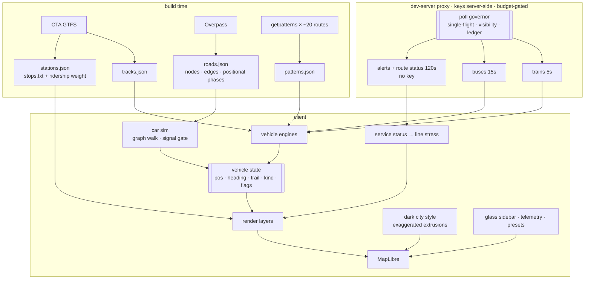

# feat: CHI-TRON v2 — Neon City (aesthetic + liveness pass)

**Target repo:** `chi-tron` (github.com/jorelsantos/chi-tron, private). All paths repo-relative.

---

## Summary

Turn the working MVP into a bustling cyberpunk metropolis. Two phases: **Phase A** delivers the look (dramatic near-black buildings, hairline neon lines with bloom, ridership-weighted station nodes, the instrument sidebar, the hero Loop camera) so the aesthetic payoff lands before the heavy work. **Phase B** adds the life (polling safety, buses, ambient street traffic, and service disruptions rendered as light). Visual quality outranks data fidelity throughout.

## Problem Frame

The MVP proved the pipeline — live trains gliding on real track geometry — but looks like a data viz, not a place. The city is nearly empty: 43 trains move, buildings are flat and dim, and there is no punctuation on the lines. The chrome is thin next to the craft benchmark.

**Reference studied:** the Tokyo Metro 3D map by @halukik_0520 ([post](https://x.com/halukik_0520/status/2072518426812465158)) — *not* nagix/mini-tokyo-3d, which was the wrong reference and is discarded. Design language read from video frames extracted 2026-07-28. What we take: vibrant saturated hairline lines with soft bloom on near-black; a translucent glass sidebar with per-line badges and live counts; small-caps wide-tracked telemetry in the corners; a gold "in operation" counter; camera-preset buttons; a compass. What we do not take: it has no basemap or buildings at all (opposite of our direction), and it makes vertical depth the hero (deferred — see Scope Boundaries).

The reference runs a *simulated timetable*, not a live feed, which confirms that feed accuracy is secondary to how it looks.

---

## Requirements

- **R1** — 3D buildings read as a dramatic dark skyline: exaggerated heights, near-black bodies, neon-tinted top light. Buildings never compete with transit for attention.
- **R2** — Transit lines adopt the reference's treatment: hairline bright core plus wide soft bloom halo, in vibrant saturated colors on near-black, and all eight remain mutually distinguishable.
- **R3** — Trains read as Tron light-cycles: hot white core, sharp neon trail, additive brightening where trails cross. Delay and approach state are visible.
- **R4** — CTA buses render live in a neutral color, visibly subordinate to trains and visually distinct from cars.
- **R5** — Ambient car traffic moves along real downtown streets and holds at intersections on a signal cycle that produces visible waves. Plausible, not accurate.
- **R6** — Instrument sidebar: glass panel, one row per L line with badge, name and live count; display toggles; camera presets.
- **R7** — A camera preset flies to a dramatic angle on the Loop. Camera is otherwise static — no idle orbit; manual pan/zoom/rotate always retained.
- **R8** — Top-corner telemetry and a compass, in the reference's small-caps wide-tracked style, with unambiguous count scopes.
- **R9** — Everything stays free; both API keys stay server-side and out of the bundle.
- **R10** — **API usage stays demonstrably safe**: never exceed a self-imposed fraction of CTA's 100,000/day/key limit, never burst hard enough to trip their per-IP DoS protection, and never poll while the tab is hidden.
- **R11** — Station nodes punctuate every line, with brightness scaled by real ridership so the Loop blazes and outlying stops read as embers.
- **R12** — Live service disruption is rendered as light: a line under planned work or an active incident is visibly stressed rather than reported only in text.

### Scope Boundaries

**Deferred to follow-up work:** vertical track profile (elevated Loop vs. State/Dearborn subway) with elevation ruler and depth-exaggeration slider — Jojo chose flat for this pass, but it is the highest-value follow-up since it carries much of the reference's impact; GTFS-timetable simulated service with speed multipliers (×1…×480) as a no-live-feed fallback and time-travel mode; click-a-train follow mode; station and street name labels (needs its own unit specifying type size, halo and minzoom); deploy; Metra/Divvy/flight layers; sound.

**Out of scope:** accuracy guarantees on any feed; mobile layout; historical playback; **vehicle interactivity** — all deck.gl vehicle layers stay `pickable: false` this pass, no hover tooltips or click selection.

---

## Key Technical Decisions

- **KTD1 — Hybrid direction: dark cyberpunk city + Tokyo instrument chrome.** *(session-settled: user-directed — chosen over both a basemap-free void and a pure city render: buildings stay but recede to near-black silhouettes so neon is the only light source, which is itself the Blade Runner look, while the sidebar and telemetry craft come from the reference.)* Governs R1, R2, R6, R8.
- **KTD2 — Cars are "not subtle, not loud."** *(session-settled: user-directed.)* Interpreted as: clearly visible motion at Loop zoom, rendered as light rather than vehicles. Governs R5.
- **KTD3 — Flat this pass.** *(session-settled: user-directed — chosen over making elevation a feature; effort goes to buildings, buses, cars and lighting instead.)* Governs the Scope Boundaries deferral.
- **KTD4 — Buses position by `pdist`, not snapping.** `getvehicles` returns each bus's `pdist` (feet along its pattern) and `pid`; `getpatterns` returns that pattern's polyline with per-point `pdist`. Direct interpolation, strictly better than the trains' snap-to-nearest approach. Verified live 2026-07-28.
- **KTD5 — Bus route subset on API v3.** `getvehicles` caps at **10 routes per call** (documented and verified). Ship ~20 marquee high-frequency routes = 2 calls per poll. Use the **v3** base (`https://www.ctabustracker.com/bustime/api/v3/`) — the 2025-04-21 guide documents v3; v2 still answers but is not current. Live buses (rather than simulating them from `patterns.json` as we do cars) are worth the second key because `dly` and real bunching produce clustering no simulation would invent, and it is the only feed that shows the street network in use.
- **KTD6 — Bake the ambient road graph at build time via Overpass.** A downtown bbox of OSM centerlines becomes `public/data/roads.json`, same pattern as `tracks.json`. Chosen over client-side vector-tile querying, which only sees loaded tiles, returns tile-clipped geometry, and makes car behavior depend on camera position.
- **KTD7 — Glow is a gated decision, not an assumption.** Start with layered additive geometry (stacked wide-translucent / narrow-bright passes). U8 gates on a side-by-side against the reference; **if it fails, the escape path is real bloom** — move transit-line rendering out of the MapLibre style into deck.gl, add `@luma.gl/effects`, and apply a `PostProcessEffect` bloom pass inside U8. Two constraints found during review: `PostProcessEffect` ships in the installed `@deck.gl/core` 9.3.7 but `@luma.gl/effects` is **not installed**, and the overlay currently runs `interleaved: false`, so a bloom pass would not touch MapLibre-drawn layers. Whichever path ships gets recorded in the session notes.
- **KTD8 — Render budget with a numeric floor and a degradation ladder.** Floor: **sustained 30 fps at the Loop framing with all layers on**, measured on Jojo's machine in the browser preview via the FPS meter U7 adds. A unit that misses the floor is not done. Apply in order until it passes: lower the car cap → lower the bus cap → drop the third line-glow pass → raise the building-extrusion minzoom → reduce the bus route subset. Standing mechanisms: **both** cars and buses capped and viewport-culled, buses single-pass (no glow stack), extrusions minzoom-gated. Realistic load to budget against: ~300 cars and **400–700 buses** — the ~20 marquee routes are the high-frequency ones, so at CTA's ~1,800 peak vehicles across 126 routes the subset lands well above a naive per-route average.
- **KTD9 — Signal phases come from position, not a hash.** A coordinate hash decorrelates neighbouring intersections by construction, producing flicker rather than the green waves R5 promises. Bake each node's phase as a linear function of its position along the dominant street axis, so consecutive intersections on a corridor get progressive offsets — still stateless at runtime, still baked at build time.
- **KTD10 — Self-imposed API ceiling well under CTA's.** CTA allows 100,000 requests/day per key (both Train and Bus Tracker, confirmed in both developer guides) and runs per-IP DoS protection that can time out a noisy client. Target **≤25,000/day/key** — roughly 25% of the allowance — enforced by a client-side ledger that hard-stops polling at the ceiling. Governs R10.

### Verified External Facts (2026-07-28)

| Fact | Value | Source |
|---|---|---|
| Train Tracker daily limit | 100,000 transactions; per-IP DoS protection can trigger a temporary timeout | Train Tracker guide v1.46 |
| Bus Tracker daily limit | 100,000 requests per key | Bus Tracker guide v3.0 |
| `getvehicles` route cap | 10 identifiers per call | Bus Tracker guide v3.0 |
| `ttarrivals` / `ttpositions` `rt` cap | Error appendix documents max 4 for `rt`; an 8-route `ttpositions` call returns `errCd: 0` with all 8 routes | Guide appendix + live test |
| Route Status + Detailed Alerts APIs | `routes.aspx`, `alerts.aspx` — **no API key required**, JSON supported | Customer Alerts API page + live test |
| Unused fields already in our train payload | `isDly` (delayed), `isApp` (approaching/due), `nextStaNm`, `destNm` | Train Tracker guide |

---

## High-Level Technical Design

Vehicle sources converge on one render contract, so layer code does not care what kind of thing it draws:



**Poll governor** (R10, KTD10) — one place that owns every outbound request:

```
before any fetch:
  if document hidden           → skip (resume on visibilitychange)
  if a call for this feed is in flight → skip (single-flight)
  if today's ledger ≥ ceiling  → stop feed, surface BUDGET HOLD
  else fetch; on non-200 → exponential backoff, cap 60s
ledger: per-key count in localStorage, keyed by local date, reset at midnight
```

**Car simulation** — each intersection's phase is baked from its position along the dominant street axis (KTD9); a global clock decides whether its north-south or east-west approach is green on a ~8s cycle. A car occupies an edge at a distance along it; on reaching the end it reads its node's phase, holds if red, else picks the next edge preferring straight-ahead and weighting by road class. Off-viewport cars are frozen.

**Loop framing** is fixed once, in U7, as a `LOOP_PRESET` constant in `src/style.js` beside the existing `CHICAGO_LOOP` export — its center offset east so the downtown core sits centered in the map area right of the sidebar, not behind it. U7, U11 and U13 all reference that one constant, so height tuning, traffic tuning and frame measurement all happen at the framing that ships.

---

## Implementation Units

### Phase A — The Look

Resequenced so the aesthetic payoff and the frame-budget baseline land before the two heaviest units. U12 no longer waits on buses or cars; their toggles are added by the units that create them.

### U7. Dark city restyle, dramatic buildings, Loop framing

**Goal:** The skyline becomes the Blade Runner stage, and the framing everything else is judged at exists.
**Requirements:** R1. **Dependencies:** none.
**Files:** `src/style.js`, `src/main.js`, `index.html`.
**Approach:**
1. **Add a rolling FPS meter** to the existing `frame()` loop in `src/main.js`, exposed on `window` and rendered in a small `.hud` element. Nothing in the repo measures frame rate today, so KTD8's floor and every later unit's frame check are unmeasurable without this. It comes first.
2. Export a `LOOP_PRESET` constant (center offset east of the true Loop center, zoom, pitch, bearing) beside `CHICAGO_LOOP`; jump to it on load so every later unit tunes against the shipping framing.
3. Exaggerate extrusion height (roughly 1.6–2.2× `render_height`, tuned by eye) so downtown towers dominate.
4. Drop building fill to near-black with a height-driven ramp toward a deep neon tint only at the tops, so mass reads by silhouette. Keep the ramp's hue **outside** the Blue and Purple line hues so lines never read as building edge light.
5. Light the crowns with a **second `fill-extrusion` layer whose `fill-extrusion-base` sits at `render_height`** and whose height adds a small delta. A `line` layer cannot do this — maplibre-gl 5.24's spec has no `line-z-offset`, so a line pass renders flat at the footprint.
6. Fix two pre-existing bugs in the `buildings-3d` layer while here: its `minzoom: 12` is dead weight because OpenFreeMap's `building` source-layer starts at z13, and it never filters `hide_3d`, which OpenMapTiles sets on features meant to be excluded from 3D.
7. Darken ground, water and roads further; keep the faint street grid. Add horizon haze via the **`sky` block's `fog-color` / `fog-ground-blend` / `horizon-fog-blend`** — maplibre-gl 5.24 has no root-level `fog` property (verified against the installed style spec).
8. **Decide and record the depth question.** The overlay currently runs `interleaved: false` and every layer sets `depthTest: false`, so deck.gl draws over the whole MapLibre canvas and buildings can never occlude trains — at 2× heights and pitch 57, trains will glow *through* tower faces. Decide whether that x-ray read is the intended Blade Runner look (keep as-is) or whether to switch `MapboxOverlay` to `interleaved: true` for a shared depth buffer, and note which shipped.
**Patterns to follow:** existing `DARK_CITY_STYLE` layer list and the CARTO fallback in `src/main.js`.
**Test scenarios:** none behavioral — styling and instrumentation. **Verification:** at `LOOP_PRESET`, buildings visibly tower and read as dark silhouettes; the FPS meter reads out; console clean; frame rate recorded as the baseline for KTD8's floor.

### U8. Neon lines, station nodes, train retune

**Goal:** Lines glow, stations punctuate them, and trains read as Tron light-cycles against the new brightness.
**Requirements:** R2, R3, R11. **Dependencies:** U7.
**Files:** `src/style.js`, `src/layers.js`, `src/main.js`, `scripts/build-tracks.mjs`, `public/data/stations.json`, `src/stations.test.js`.
**Approach:**
1. Replace the two-pass track underglow in `addTrackUnderglow()` (`src/main.js`) with a three-pass stack per line (wide/very-low-opacity, mid, hairline-bright). Structure each pass so a per-line filter can hide it (U12 needs this).
2. Push line colors past the official CTA palette toward the reference's vividness, holding all eight mutually distinguishable.
3. Extend `build-tracks.mjs` to also emit `stations.json` from the GTFS `stops.txt` it already downloads, joined to station-level ridership from the City of Chicago portal to give each station a normalized weight. Render stations as line-colored rings whose radius and brightness scale with that weight (R11).
4. Re-tune the existing three-disc glow heads and `TripsLayer` against the brighter lines, and switch trail blending to additive so crossing trails brighten (R3).
5. Surface train state already present in the payload: a train with `isDly` pulses red-shifted; one with `isApp` brightens as it nears its station (R3).
**Execution note:** the reference side-by-side in Verification is a **pass/fail gate**, not an observation — on failure, take KTD7's bloom path inside this unit rather than shipping the layered stack.
**Test scenarios:**
- `stations.json` contains a node for every station on all eight lines.
- Every station coordinate falls inside the Chicago bbox and within a short distance of its line's polyline.
- Ridership weights are normalized to a bounded range, and a station missing ridership data gets the floor weight rather than `NaN` or being dropped.
- A train with `isDly` true renders in the delayed treatment and reverts when the flag clears.
**Verification:** side-by-side against the reference frame at comparable zoom — lines read as glowing, not drawn; all eight line colors nameable by eye from the map alone; each hairline core stays visible where it crosses a building top; the Loop's station ring cluster is visibly brighter than outlying stops.

### U12. Instrument sidebar and telemetry chrome

**Goal:** The reference's precision-instrument UI, and the per-layer escape hatch for the frame budget.
**Requirements:** R6, R8. **Dependencies:** U8.
**Files:** `index.html`, `src/hud.js`, `src/main.js`, `src/style.js`, `src/layers.js`.
**Approach:**
1. Sidebar docks **left**, fixed ~300px, starting below the wordmark; the disclaimer moves to bottom-center. Glass recipe: `backdrop-filter` blur plus a near-opaque dark scrim behind text rows and a hairline neon border, so row contrast never depends on what the map draws underneath.
2. `LINES` section (labeled `IN SERVICE`, system-wide counts): one row per L line — badge, name, count right-aligned. Clicking a row hides **that line's three track passes, its stations, its vehicles and its trails** via one shared visibility set. Three row states: active (full badge, white count), off (unfilled ring, dimmed text), no-data (count renders as an em dash when zero or when status is `SIGNAL LOST`).
3. `DISPLAY` toggles: trains, buildings, stations. (Buses and cars toggles are appended by U9 and U11.)
4. Top-right telemetry labeled `IN VIEW`, small-caps wide-tracked, plus a compass reflecting bearing; stacked below the existing clock and status without collision. Both count blocks derive from one engine snapshot so they cannot disagree beyond the viewport filter. Apply the viewport filter to **all three** vehicle kinds — only cars have a viewport rule today, so trains and buses would otherwise be labeled `IN VIEW` while reporting system-wide totals.
5. Replace the single shared feed indicator with **per-feed status** (trains, buses, alerts), since the app now runs three independent feeds behind one `LIVE FEED` light. Include `BUDGET HOLD` from U14 as a state.
6. Line rows, toggles and preset buttons are native `<button>` elements with `aria-pressed` and a visible `:focus-visible` neon ring.
**Patterns to follow:** existing `.hud` conventions in `index.html` — absolute positioned, `pointer-events: none` except controls.
**Test scenarios:**
- Toggling a line row off removes that line's track glow, stations, vehicles and trails; toggling back restores all four.
- A toggled-off row renders the off state, so on/off is readable without looking at the map.
- Counts render as an em dash when the feed status is `SIGNAL LOST`, rather than freezing at a stale number.
- Sidebar counts (`IN SERVICE`) and telemetry counts (`IN VIEW`) both trace to the same engine snapshot for the same frame.
- Toggling a DISPLAY layer off measurably reduces render work and leaves other layers rendering.
- Sidebar and overlays never intercept map drag or zoom outside their own bounds.
- Every control is reachable by keyboard and shows a focus ring.
**Verification:** driven in the browser preview; counts cross-checked against engine state.

### U13. Camera presets

**Goal:** One click flies to the hero Loop angle; camera otherwise stays put.
**Requirements:** R6, R7. **Dependencies:** U12.
**Files:** `src/hud.js`, `src/main.js`.
**Approach:** A `CAMERA` row in the sidebar. `LOOP` consumes U7's `LOOP_PRESET` constant via an eased `flyTo` — it does not define its own numbers. `CITY` returns to the wide default. Buttons are momentary, not selected: hover brighten, a brief active flash while in flight, no persistent highlight after landing (a sticky highlight would misreport camera state the moment the user pans). No auto-rotate, no idle animation (R7).
**Test scenarios:**
- Clicking `LOOP` settles at exactly `LOOP_PRESET`'s center, zoom, pitch and bearing.
- Clicking `CITY` returns to the default framing.
- User drag during a flight is not fought by subsequent automated camera movement.
- No camera movement occurs while the app sits idle.
- No preset button retains a selected appearance after its flight lands.
**Verification:** camera state read back after each preset; idle observation confirms a static camera.

### Phase B — The Life

### U14. Poll governor and API budget safety

**Goal:** Make it structurally hard to get rate-limited or blacklisted. Lands before the second feed exists.
**Requirements:** R10. **Dependencies:** none (sequence before U9).
**Files:** `src/poller.js`, `src/poller.test.js`, `src/trains.js`, `src/main.js`, `index.html`.
**Approach:** One governor owning every outbound request, per the High-Level Technical Design pseudo-code: visibility gate, per-feed single-flight, exponential backoff capped at 60s, and a `localStorage` daily ledger per key enforcing KTD10's ≤25,000/day ceiling. On ceiling, stop that feed and surface a `BUDGET HOLD` HUD state alongside the existing `LIVE FEED` / `SIM MODE` / `SIGNAL LOST`. Migrate `TrainEngine`'s existing poll loop onto it.
**Execution note:** build this test-first — it is pure logic, and it is the unit whose failure mode is an angry email from CTA.
**Test scenarios:**
- No fetch is issued while `document.visibilityState` is `hidden`; polling resumes on `visibilitychange`.
- A second poll for the same feed while one is in flight is skipped, not queued.
- Consecutive failures back off exponentially and cap at 60s, then recover to the normal interval on success.
- The ledger increments per request and persists across a page reload (a reload must not reset today's count).
- At the ceiling, that feed stops issuing requests and the HUD shows `BUDGET HOLD`.
- The ledger resets when the local date changes, and a stale prior-day entry does not carry forward.
- Mock mode issues zero network requests.
**Verification:** `read_network_requests` shows no traffic with the tab hidden; a temporarily-lowered ceiling demonstrably halts polling and shows `BUDGET HOLD`.

### U9. Bus layer

**Goal:** Live CTA buses on their real route patterns, neutral and subordinate.
**Requirements:** R4, R9. **Dependencies:** U8, U14.
**Files:** `src/buses.js`, `src/buses.test.js`, `scripts/build-patterns.mjs`, `public/data/patterns.json`, `vite.config.js`, `src/layers.js`, `src/hud.js`, `src/main.js`.
**Approach:**
1. Add a `/api/bus` proxy route mirroring `/api/tt`, injecting `CTA_BUS_KEY` from `.env`, targeting the **v3** base (KTD5, R9).
2. `build-patterns.mjs` fetches `getpatterns` once per marquee route into `patterns.json` — no runtime pattern calls.
3. Poll `getvehicles` through the U14 governor in two 10-route calls every 15s (11,520/day — inside KTD10's ceiling); position each bus by interpolating its `pid` pattern at its reported `pdist` (KTD4); tween between polls like trains.
4. Add a mock bus generator mirroring `TrainEngine.seedMock` / `#tickMock` — synthetic buses walking `patterns.json` at plausible speeds in the same state shape — so mock mode renders buses with no key and no network.
5. Render per the legibility hierarchy: cars own amber (small dim headlight dots, red taillights); **buses are an elongated capsule at a stated minimum pixel size in a cool neutral off-white that matches no L line's hue**; trains keep the hot-white core plus neon trail. Single-pass, no glow stack (KTD8).
6. **Cap the rendered bus count** (KTD8), dropping the furthest-from-viewport-center vehicles beyond the cap. Unlike cars, bus count is whatever CTA returns, so without a cap the layer with no ceiling is the one carrying the top risk.
7. **Load `patterns.json` in a guarded fetch** that warns and disables only the bus subsystem on failure. `boot()` in `src/main.js` currently `await`s `tracks.json` with no `.catch`, so an unguarded second required file would black-screen the whole app — including mock mode — for anyone who has not run the build script.
8. **Give the bus feed its own status state**, with backoff mirroring `TrainEngine.startLive`. A missing `CTA_BUS_KEY` would otherwise proxy `key=undefined`, return non-200, and leave the HUD reading `LIVE FEED` with silently absent buses.
9. Append the buses toggle to U12's DISPLAY section.
**Execution note:** build the `pdist` → lat/lon interpolation test-first; the poller is smoke-verified live.
**Test scenarios:**
- Interpolating a pattern at `pdist` 0 returns its first point; at max `pdist`, its last.
- A `pdist` midway between two pattern points returns a coordinate between them.
- A `pdist` beyond the pattern length clamps to the final point rather than extrapolating.
- A vehicle whose `pid` is missing from `patterns.json` is skipped without throwing.
- A no-buses response — CTA's `error` object, or an empty `vehicle` array — leaves prior bus state intact and does not clear the map.
- The route set is split into calls of at most 10 routes each (guards KTD5's cap).
- Mock mode yields buses on multiple routes with zero network calls.
- Rendered bus count never exceeds the configured cap.
- A missing `patterns.json` disables buses with a warning while trains and the rest of the map still render.
- A non-200 from `/api/bus` sets the bus feed's own lost state without changing the train feed's status.
**Verification:** bus counts logged per route; `read_network_requests` shows 200s on `/api/bus` and no key in any payload; buses visibly track major corridors and are distinguishable from cars at the Loop framing.

### U10. Ambient traffic — road graph

**Goal:** A baked downtown street graph with positional signal phases and no traffic sinks.
**Requirements:** R5. **Dependencies:** none.
**Files:** `scripts/build-roads.mjs`, `public/data/roads.json`, `src/roads.test.js`.
**Approach:**
1. Overpass query for a downtown bbox sized to cover the viewport at the **minimum zoom where cars render** (see U11) at the default pitch, so the graph boundary is never on screen. `highway=primary|secondary|tertiary|residential`, carrying `oneway` and `name`. Use `out geom(bbox)` so geometry is clipped to the box — this is what keeps the all-coordinates-inside-bbox invariant true, and it is why step 3 is mandatory rather than optional.
2. Build nodes from shared endpoints; edges with geometry, length, class and oneway direction.
3. **Iteratively** drop nodes with no outbound edge together with their inbound edges until no sinks remain. Clipping a one-way downtown grid guarantees boundary sinks, and real cul-de-sacs add more; without this prune the no-dead-end invariant and the clipped-geometry invariant cannot both hold, and U11's legal-outbound-edge guarantee has no basis.
4. Bake each node's phase as a linear function of its position along the dominant street axis (KTD9), plus each edge's approach axis (north-south or east-west).
5. Fail the build if output exceeds **1 MB** (roughly 10× `tracks.json`'s 95 KB) — it lands on the same pre-map critical path, and a four-class downtown extract can reach several MB unpruned.
**Test scenarios:**
- Every edge references two node ids that exist in the node table.
- All coordinates fall inside the requested bbox.
- No node lacks an outbound edge, after sink pruning.
- Oneway edges expose exactly one traversal direction; two-way edges expose both.
- Consecutive nodes along a corridor have monotonically progressing phase offsets (this is what makes waves possible, and a hash would fail it).
- Output stays under the 1 MB budget, and the build fails rather than emitting an oversized file.
**Verification:** script idempotent; node/edge counts, pruned-sink count and file size reported.

### U11. Ambient traffic — car simulation and rendering

**Goal:** The city feels alive — cars flowing and stopping in waves, seen as light.
**Requirements:** R5. **Dependencies:** U10, U8.
**Files:** `src/cars.js`, `src/cars.test.js`, `src/layers.js`, `src/hud.js`, `src/main.js`.
**Approach:** Implement the graph-walk plus signal-gate model from the High-Level Technical Design, reading U10's baked positional phases. Render per KTD2 and U9's legibility hierarchy: small dark bodies with an amber headlight pair and red taillights so travel direction is legible — cars need a heading in their state for this. Cap car count, freeze off-viewport cars, and **fade the car layer out below the minimum zoom U10's bbox was sized for**, so the graph edge never shows. **Reset a car's `lastTick` when it re-enters the viewport and clamp per-frame `dt` to a ceiling** — a car frozen while the user pans would otherwise thaw with a `dt` covering the whole freeze and teleport through intersections without ever evaluating a phase. (`src/trains.js` has the same unclamped-`dt` shape; clamp it there too while in this code.) Load `roads.json` in a guarded fetch that disables only cars on failure. Append the cars toggle to U12's DISPLAY section.
**Execution note:** the signal-gate and edge-transition logic is the bug-prone part — build it test-first before wiring rendering.
**Test scenarios:**
- A car on a green approach crosses its node and continues onto a new edge.
- A car on a red approach stops before the node and resumes when the phase flips.
- Crossing approaches at one node (north-south vs. east-west) are never simultaneously green.
- A car always selects a legal outbound edge, never a oneway against its direction.
- Distance remaining after an edge transition carries over rather than being discarded (no stutter at intersections).
- Cars outside the viewport are skipped by the update loop.
- The car layer renders nothing below the configured minimum zoom.
- Car count never exceeds the configured cap regardless of runtime duration.
- A car thawed after a long off-viewport freeze advances at most one edge in its first frame, rather than teleporting.
- A missing `roads.json` disables cars with a warning while trains, buses and the map still render.
**Verification:** at `LOOP_PRESET`, traffic visibly flows and pauses in waves; no dead-traffic boundary is visible at the `CITY` preset; frame rate meets KTD8's floor with cars enabled.

### U15. Service status as light

**Goal:** The city's nervous system shows stress — disruption rendered as light, not text.
**Requirements:** R12. **Dependencies:** U8, U14.
**Files:** `src/alerts.js`, `src/alerts.test.js`, `src/layers.js`, `src/hud.js`, `src/main.js`, `vite.config.js`.
**Approach:**
1. Poll the keyless Route Status (`routes.aspx?type=rail`) and Detailed Alerts (`alerts.aspx?activeonly=true&accessibility=true`) APIs through the U14 governor every 120s. No key, so no ledger cost — but the same single-flight and visibility gates apply.
2. Map each line's `RouteStatus` to a light treatment: normal renders as-is; planned work renders with a slow amber breathing pulse on that line's glow passes; an active incident renders red-shifted and unstable. Added service gets a brighter, cooler cast.
3. Elevator/accessibility alerts mark their affected stations with a small amber glyph, so infrastructure trouble reads at station scale.
4. Add a `SYSTEM STATUS` block to the sidebar listing any line not in normal service, with its headline text truncated.
**Test scenarios:**
- Each documented `RouteStatus` value maps to exactly one defined treatment, and an unrecognized value falls back to normal rather than throwing.
- A line returning to normal service clears its stressed treatment.
- An alert naming stations marks those stations and no others.
- A malformed or empty alerts payload leaves the previous status intact and does not clear the map.
- The status block lists only non-normal lines, and renders empty-state text when everything is normal.
**Verification:** compare rendered per-line treatment against transitchicago.com's own published system-status snapshot at the same moment; confirm elevator glyphs match the site's current elevator alert list.

---

## Risks & Mitigations

- **Frame rate collapse** from buildings + stations + buses + cars + glow — the top risk. KTD8 now has a numeric floor and an ordered degradation ladder, checked per unit, and Phase A establishes the baseline before Phase B adds load. U12's toggles ship before the heavy units, so per-layer cost can be isolated while measuring.
- **The glow bet fails** and lines still read as drawn. KTD7 now names the bloom escape path and U8 gates on it, including the two constraints review surfaced (missing `@luma.gl/effects`, `interleaved: false`).
- **Getting rate-limited or blacklisted.** R10/KTD10/U14: ≤25% of the documented allowance, hard-stopping ledger, visibility gating, single-flight, backoff. Build-time pattern baking keeps `getpatterns` off the runtime path entirely. Worst-case steady-state draw is ~17,280/day on the train key and ~11,520/day on the bus key — both under the 25,000 ceiling and well under CTA's 100,000. The residual exposure is burst rate against their per-IP DoS protection, which single-flight and the 5s/15s/120s floors bound to roughly 20 requests/minute.
- **Buses visually swamp trains, or blur into cars.** KTD5's route subset, single-pass rendering, the explicit three-way legibility hierarchy in U9, and a toggle.
- **Overpass rate-limits or times out.** Build-time only, so retry is free; committed output makes the fetch one-time. Note that shrinking the bbox increases boundary sinks, which U10's pruning step handles.
- **Cars look wrong rather than alive.** KTD9 fixes the wave problem at its root; U11's scenarios target jitter and illegal turns; density is tuned visually in mock mode.
- **Trains draw *through* exaggerated towers, not behind them.** The overlay runs `interleaved: false` and every layer sets `depthTest: false`, so deck.gl composites over the whole MapLibre canvas and shares no depth buffer with `fill-extrusion` — buildings cannot occlude trains as configured. At 2× heights and pitch 57 the x-ray effect becomes conspicuous. U7 step 8 makes this an explicit decision (keep the x-ray read, or switch to `interleaved: true`) rather than a discovery. Note that a real bloom pass would also only touch deck-drawn content under `interleaved: false`.
- **Ridership data shape is unverified.** U8's station weighting depends on a City of Chicago dataset not yet inspected; its test scenarios require a floor weight for missing entries so a join failure degrades to uniform rings rather than breaking U8.

## Verification Contract

1. Mock mode (`?mock=1`) renders trains, buses and cars with zero console errors and **zero network requests** — the always-green gate.
2. Live mode: both proxies return 200s; neither API key appears in any served asset or network payload.
3. Vitest suite passes: station data, bus interpolation, road-graph integrity, car simulation, poll governor, alert mapping.
4. Frame rate at `LOOP_PRESET` with all layers on **meets KTD8's 30 fps floor** — recorded, and compared against the floor rather than merely noted.
5. **Legibility:** all eight line colors nameable by eye from the map alone; a bus, cars and a train distinguishable in one frame; hairline cores visible where they cross building tops.
6. **Chrome:** sidebar line toggles and DISPLAY toggles exercised, `LOOP` and `CITY` presets land correctly, compass tracks bearing, every control keyboard-reachable.
7. **API safety:** no requests issued with the tab hidden; ledger survives reload; a lowered test ceiling halts polling and surfaces `BUDGET HOLD`.
8. Screenshots delivered to Jojo: `LOOP_PRESET`, wide city, and a close-up containing a train, a bus and cars together.

## Definition of Done

All twelve requirements demonstrably met via the Verification Contract; per-unit commits pushed to the private repo; README updated with the bus key setup, the three build scripts, the documented API budget, and the revised follow-up list naming the vertical profile and GTFS-timetable simulation as the next pass.

## Deferred to Implementation

Building height multiplier and top-tint hue; exact neon palette within the distinguishability constraint; car density, speed and minimum render zoom; bloom pass sizing if that path is taken; the marquee bus route list; `LOOP_PRESET`'s exact numbers; ridership normalization curve; sidebar type scale. All visual judgment calls tuned live in mock mode; none change architecture.

## Sources & Research

- Tokyo Metro 3D reference — [@halukik_0520](https://x.com/halukik_0520/status/2072518426812465158); design language read from extracted video frames, 2026-07-28. Shaped KTD1, KTD7, R2, R6, R8, R11.
- [CTA Developer Center](https://www.transitchicago.com/developers/) — full feed catalog reviewed 2026-07-28: Train Tracker, Bus Tracker, Customer Alerts, GTFS, open data sets, RSS. Surfaced the alerts APIs behind R12/U15.
- Train Tracker Developer Guide v1.46 and Bus Tracker Developer Guide v3.0 (PDF text extracted 2026-07-28) — 100,000/day limits, per-IP DoS protection, the 10-route `getvehicles` cap, the `rt` error-appendix cap, and the unused `isDly`/`isApp` fields. Shaped KTD5, KTD10, R10, U14, and U8 step 5.
- [Customer Alerts API](https://www.transitchicago.com/developers/alerts/) — Route Status and Detailed Alerts endpoints, no key required, verified live. Shaped R12, U15.
- CTA Developer License Agreement — no reselling raw data, no implied CTA affiliation; the disclaimer stays visible (carried from plan 001).
- nagix/mini-tokyo-3d — investigated and **discarded** as the wrong reference; retained only as evidence the MapLibre-plus-3D-vehicles approach works at this scale.

## Review Record — 2026-07-28

Five of six reviewers returned: coherence, feasibility, design-lens, scope-guardian, adversarial. **Security-lens terminated on an API error and did not run**; its ground is partly covered by R9/R10 and the verified key posture (`.env` gitignored, no `VITE_` prefix, proxy-injected server-side, no secret tracked in git). Cross-model peer review was **declined by Jojo** — the plan was not sent to any outside provider.

**Integrated (convergent across reviewers):** R3 had no owning unit → U8. Three units verified against a Loop preset the last unit built → `LOOP_PRESET` in U7. The mock-mode gate required buses no unit produced → U9 step 4. The render budget had no threshold → KTD8's floor and ladder. Coordinate-hash signal phases could not produce the promised waves → KTD9. The baked bbox showed a dead-traffic edge → U10 step 1 plus U11's zoom fade. The line toggle missed track glow → U12 step 2. The `labels` toggle had nothing to toggle → dropped, labels deferred.

**Integrated (feasibility, verified against installed packages):** maplibre-gl 5.24 has no root-level `fog` property and no `line-z-offset` → U7 steps 5 and 7 rewritten. No FPS instrument exists → U7 step 1. `interleaved: false` plus `depthTest: false` makes building occlusion impossible → the occlusion risk was wrong and is replaced. `boot()` awaits `tracks.json` with no `.catch` → guarded loads in U9 and U10. Bus count was uncapped and the ~200 budget figure understated it → KTD8 revised to 400–700 plus a U9 cap. Frozen cars thaw with unbounded `dt` → U11 clamp. One shared feed indicator for three feeds → U12 step 5. Missing `CTA_BUS_KEY` would silently proxy `key=undefined` → U9 step 8.

**Rejected:** feasibility claimed the Bus Tracker default cap is 10,000/day and that KTD5's poll would exceed it. The official Bus Tracker guide v3.0 states 100,000, and the string "10,000" appears nowhere in either developer guide (both PDFs text-extracted and searched 2026-07-28). KTD5's 15s interval stands.

**Deferred to Jojo** (surfaced, not applied): scope-guardian and adversarial both questioned whether live bus positions earn a second key given buses render as dim single-pass sprites — KTD5 now records the rationale, but simulating buses from `patterns.json` the way cars are simulated remains a legitimate alternative. Design-lens raised station/street labels and vehicle hover-inspection, both now explicit Scope Boundaries deferrals.
