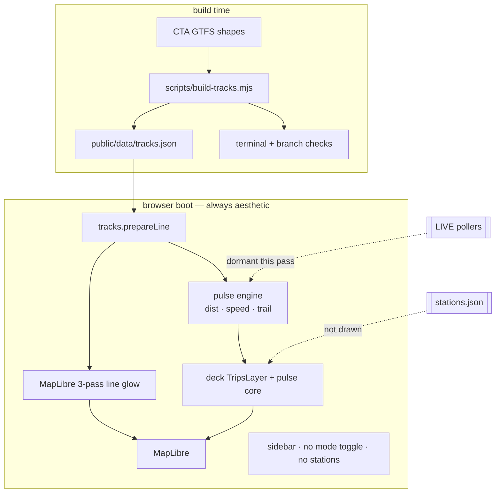

# feat: Tron line-pulse aesthetic (design-first)

**Target repo:** `chi-tron` (this repo). All paths repo-relative.

---

## Goal Capsule

- **Objective:** Make EXPLORE the only on-screen mode and nail the cyberpunk L look: geographically accurate glowing lines with fast Tron energy pulses racing end-to-end — no station dots, no LIVE toggle this pass.
- **Authority:** This plan > prior neon-city plan units on conflicting UI/render choices for trains in aesthetic mode. LIVE plumbing stays in the tree but dormant.
- **Execution profile:** Visual smoke-first for glow/pulse; unit tests for geometry and pulse math.
- **Stop when:** All eight lines read as accurate CTA corridors; pulses race full lines; stations and mode toggle are gone from the UI; browser look is judged “Tron / Edgerunners” rather than data-viz; tests pass.
- **Tail ownership:** Implementer owns commits; no deploy.

---

## Product Contract

### Summary

Design-first pass: freeze the map as always-on aesthetic simulation, strip station rings, keep CTA track geography honest, and replace discrete “train vehicle” heads with full-line Tron pulses. Live feeds and bus redesign stay deferred.

### Problem Frame

Neon-city shipped a capable live-capable city, but the look still reads as instrumented data viz. Station rings clutter the grid. Discrete mock trains move at plausible L speeds instead of energy racing the network. EXPLORE/LIVE competes with the design work. Live can layer back later once the grid itself feels like CHI-TRON.

The rings in the attached screenshot are **station nodes** (ridership-weighted rings from `stations.json` / U8), not trains.

### Requirements

**Mode & chrome**

- R1. Boot always in aesthetic simulation (today’s EXPLORE behavior). No EXPLORE/LIVE toggle in the HUD this pass.
- R2. LIVE train/bus poller code may remain in the tree but must not start, poll, or be user-reachable from the UI this pass. Live returns in a later pass.
- R3. Station rings and accessibility glyphs do not render. The Stations display toggle is removed or inert.

**Track geography**

- R4. All eight L lines render on geometry that matches real CTA corridors (terminals, main trunks, and documented branches) well enough that a Chicago rider can name each line from the map alone.
- R5. Known geometry defects in the longest-shape heuristic are found and fixed or explicitly documented as residual limits (not silent wrong paths).

**Tron pulse look**

- R6. Each L line has a continuous neon glow (hairline core + soft bloom), saturated per-line color, mutually distinguishable.
- R7. Each line carries at least one fast-moving light pulse that travels the full prepared polyline from one end of the baked shape to the other (and continues looping or reversing in a way that reads as continuous energy, not a slow train).
- R8. Pulses read as light energy, not rolling stock: no station-scale vehicle heads as the hero motion.
- R9. Frame rate at `LOOP_PRESET` with pulses on stays at or above the existing 30 fps floor when other layers are left as they are today.

**Focus**

- R10. Trains (lines + pulses) are the only vehicle system tuned this pass. Buses and cars may remain visible with current behavior; they are not redesigned here.

### Scope Boundaries

**In scope**

- HUD mode toggle removal / always-sim boot
- Station layer off / toggle cleanup
- Track build accuracy audit + `tracks.json` rebuild when needed
- Pulse motion + glow retune for L lines
- Tests for geometry invariants and pulse math
- Browser visual verification of the aesthetic

**Deferred to Follow-Up Work**

- Re-enabling LIVE mode (trains + buses) on top of this aesthetic
- Bus visual redesign (capsule/pulse language)
- Car density / road graph retune
- Station labels and optional station markers under a new treatment
- Click-to-follow retuned for live vehicles (after LIVE returns)
- Deploy / key-proxy worker
- Metra, Divvy, flights, sound

**Out of scope**

- Live feed correctness this pass
- Mobile layout
- Real Chicago building footprints (still OpenFreeMap extrusions)
- Vertical track elevation

### Key product decisions

- Always aesthetic first; live later (session-settled: user-directed — kill LIVE UI for now; keep plumbing so live can return).
- Geographic accuracy of L lines is a first-class requirement of this pass (session-settled: user-directed).
- Pulse-only hero motion for trains this pass (session-settled: user-approved — recommended default; discrete vehicle heads are not the design target).

Product Contract preservation: bootstrap from conversation; no prior requirements-only artifact.

---

## Planning Contract

### Key Technical Decisions

- KTD1. **Always-sim boot, LIVE dormant.** (session-settled: user-directed — chosen over deleting poller/LIVE code: live returns later.) Default `mode = 'explore'`; remove or hide mode buttons; do not call `startLive()` on boot; ignore `?live=1` or map it to sim with a console note. Poll governor and engines stay importable for the future pass.
- KTD2. **Stations off at the render contract.** Do not draw station Scatterplot layers; stop fetching/using station brightness for UI. Prefer display default `stations: false` plus removing the Stations control so the HUD cannot re-enable clutter. Keep `stations.json` / build script for a later pass.
- KTD3. **Pulse engine on track polylines, not GPS vehicles.** Model one or more pulses per line as distance-along-track state (`dist`, `speed`, `dirSign`) using existing `prepareLine` / `pointAtDist` / trail buffers. Feed `TripsLayer` the same way trains do today so additive neon trails stay free. Do not invent a second animation system.
- KTD4. **Fast energy speeds, not L mph.** Mock train speeds were ~plausible transit; pulses should read as data-light (order of magnitude faster). Exact m/s is tuned in browser; store as named constants next to the pulse seed.
- KTD5. **Glow stays layered geometry.** Keep MapLibre three-pass track underglow + deck pulse trail/core. No `@luma.gl/effects` bloom dependency this pass unless layered glow clearly fails the visual gate (same escape as neon-city KTD7).
- KTD6. **Track accuracy before pulse polish.** Rebuild/fix `tracks.json` first so pulses race real corridors. Prefer per-line shape selection that covers the rider-visible network (trunk + major branches) over a single longest shape when that shape omits a whole branch.
- KTD7. **Buses/cars unchanged.** (session-settled: user-approved recommended default.) Leave their engines and layers running so the city still feels alive; do not spend design cycles on them.

### High-Level Technical Design



Pulse state machine (directional guidance, not implementation):

```
per line L:
  for each pulse p on L:
    each frame: p.dist += p.speed * p.dir * dt  (dt clamped)
    if past end: reverse or wrap (pick one per visual gate; default reverse like seedMock)
    sample pos = pointAtDist(L, p.dist); append trail
render: TripsLayer(trail) + small hot core at pos; no multi-disc train head stack
```

### Assumptions

- OpenFreeMap tiles remain available for the basemap stage; CARTO fallback already exists.
- Longest-shape GTFS selection is the primary accuracy risk for branched routes (Green, Blue, Purple); audit will confirm which lines need hand-picked shape IDs or multi-shape merges.
- Keeping buses/cars on does not block judging train pulse quality at LOOP/CITY presets.

### Sequencing

1. U1 mode chrome (unblocks “this is the product surface”)
2. U2 stations off (clears visual noise)
3. U3 track accuracy (pulses need honest paths)
4. U4 pulse engine + render swap
5. U5 glow/speed polish + visual gate

---

## Implementation Units

### U1. Always-aesthetic boot; hide LIVE

**Goal:** App only offers the design surface — simulated network, no mode switch.
**Requirements:** R1, R2.
**Dependencies:** none.
**Files:** `src/main.js`, `src/hud.js`, `index.html`, tests that assert mode if any (`src/layers.test.js` only if mode flags affect layers).
**Approach:**
1. Force aesthetic boot; remove `?live=1` LIVE path from user-facing behavior (ignore or force sim).
2. Stop wiring EXPLORE/LIVE buttons in `createHud` / remove `#mode-rows` chrome from `index.html`.
3. Ensure `TrainEngine` / `BusEngine` only seed mock paths at boot; no `startLive()`.
4. Leave `Poller`, LIVE methods, and API proxies in place for the future live pass.
**Patterns to follow:** existing `mode === 'explore'` seed paths in `src/main.js`; status labels `SIM MODE` / `BUS SIM`.
**Test scenarios:**
- Default boot path does not invoke train or bus live start (characterization: seedMock-only or equivalent assertion where extractable).
- HUD construction does not expose a LIVE control.
**Verification:** cold load shows SIM MODE, zero `/api/tt` and `/api/bus` requests; no mode toggle in the sidebar.

### U2. Remove station dots from the frame

**Goal:** No circular station rings (the attached screenshot clutter).
**Requirements:** R3.
**Dependencies:** none (parallel with U1).
**Files:** `src/layers.js`, `src/hud.js`, `index.html`, `src/main.js`, `src/layers.test.js`.
**Approach:**
1. Default `display.stations` off; omit station layers when false (already gated — lock the default and UI).
2. Remove Stations from DISPLAY toggles and any IN VIEW copy that implies stations are a primary layer.
3. Do not delete `stations.json` or the build path; just stop drawing and controlling it.
**Patterns to follow:** existing `getShownStations` / `display.stations` gate in `src/layers.js`.
**Test scenarios:**
- With default display options, `buildLayers` includes no `station-ring` / `station-halo` layer ids.
- Explicit `display.stations: true` may still build rings (keeps code path for later) OR is hard-disabled — pick one in implementation and test that choice; prefer hard-off this pass so UI cannot reintroduce dots.
**Verification:** LOOP and CITY screenshots show no station rings along lines.

### U3. Track geography accuracy

**Goal:** Baked L polylines match real CTA geography for rider recognition.
**Requirements:** R4, R5.
**Dependencies:** none (should land before U4).
**Files:** `scripts/build-tracks.mjs`, `public/data/tracks.json`, `src/stations.test.js` or new `src/tracks.geo.test.js`, optional comments in build script for shape overrides.
**Approach:**
1. Audit current `tracks.json` terminals and lengths against known CTA endpoints (Howard–95th, O’Hare–Forest Park, Midway, Linden, Dempster-Skokie, Green Harlem/Lake + Ashland/63rd / Cottage Grove branches, etc.).
2. Where longest-shape is wrong or omits a major branch, fix selection (explicit shape id allowlist per route, or emit multi-polyline features per line if one feature cannot cover the rider-visible network).
3. Keep Chicago bbox + strictly increasing `cumDist` invariants.
4. Rebuild committed `tracks.json` when selection changes.
**Execution note:** Prove geometry with automated terminal/bbox tests plus a visual CITY-preset check against memory of the CTA map — do not trust point count alone.
**Patterns to follow:** existing longest-shape loop and LINE_KEYS import in `scripts/build-tracks.mjs`; `src/stations.test.js` bbox style.
**Test scenarios:**
- All eight `LINE_KEYS` present with length above a sensible floor (reuse / tighten existing length expectations).
- Every coordinate inside Chicago bbox.
- `cumDist` strictly increasing per line.
- Per-line terminal assertions: first/last (or extrema) points fall near documented endpoints within a generous meter tolerance; branched lines either include points near each major branch terminal or are listed in a documented residual-limit comment + test skip with reason.
**Verification:** CITY view shows Red as N–S spine, Blue to O’Hare, Yellow spur, Orange to Midway, Brown/Pink/Purple reading as their corridors — no mystery diagonals.

### U4. Full-line Tron pulse engine

**Goal:** Fast light pulses race each glowing L line end to end.
**Requirements:** R6, R7, R8, R9, R10.
**Dependencies:** U3 (honest paths), U1 (always-sim).
**Files:** `src/trains.js` and/or new `src/pulses.js`, `src/layers.js`, `src/main.js`, `src/trains.test.js` or `src/pulses.test.js`, `src/layers.test.js`.
**Approach:**
1. Replace aesthetic-mode train *vehicle* population with line pulses (multiple per line allowed if density needs it). Prefer a small dedicated pulse module if `TrainEngine` LIVE paths would get tangled; keep shared geometry helpers from `tracks.js`.
2. Each pulse: high speed, trail buffer, reverse or wrap at ends; trail length short enough to read as a bolt, not a snake.
3. Render: `TripsLayer` in line color + additive blend; single tight hot core (not the three-disc train head stack).
4. Wire frame loop to pulse tick instead of (or in addition to, but without drawing) old mock trains — old vehicle heads must not remain the hero motion (R8).
5. If U3 emits multi-polyline geometry for a branched line, each branch gets its own pulse stream (same line color/key); do not assume a single cumulative path covers every branch.
6. Line glow underglow stays MapLibre three-pass; pulses ride on top.
7. Sidebar line counts: redefine as pulse counts or “IN SERVICE” presence, not fake vehicle fleet — keep chrome honest.
8. Click-to-follow: either pick pulses by id or disable follow this pass — do not leave follow bound to removed vehicle heads.
**Execution note:** Tune speed and trail length only after U3 geometry is trusted; verify at LOOP and CITY.
**Patterns to follow:** `TrainEngine.seedMock` / `#tickMock` / `#appendTrail`; `buildLayers` TripsLayer construction; `MAX_MOCK_DT_S` clamp.
**Test scenarios:**
- Seeding produces ≥1 pulse on every line.
- Pulse distance advances monotonically in one direction until an end, then reverse or wrap without NaN.
- `pointAtDist` samples stay on the polyline (finite lon/lat).
- dt clamp: large frame gap does not teleport a pulse beyond one reasonable step.
- Layers built from pulse state expose TripsLayer data and do not require station data.
**Verification:** Browser — each colored line has a quick darting light; vibe is Tron/Edgerunners; FPS ≥ 30 at LOOP with current bus/car layers on.

### U5. Glow density polish and visual gate

**Goal:** Lock the money shot after pulse math works.
**Requirements:** R6, R7, R9.
**Dependencies:** U4.
**Files:** `src/layers.js`, `src/main.js` (track underglow paint), `src/style.js` only if building contrast fights neon.
**Approach:**
1. Side-by-side tune: core width, bloom opacity, pulse speed, pulses-per-line, trail length.
2. Confirm eight line colors remain nameable at CITY zoom.
3. Confirm pulses remain visible where lines cross the Loop elevated tangle.
4. Capture LOOP + CITY screenshots as the done artifact for this pass.
**Test expectation:** none behavioral — visual unit; FPS meter is the quantitative floor.
**Verification:** Screenshots + FPS; implementer (or Jojo) sign-off that the grid feels like CHI-TRON energy, not transit CAD.

---

## Verification Contract

| Gate | Command / check | Applies |
|------|-----------------|---------|
| Unit tests | `npm test` | U1–U4 math/chrome |
| Always-sim network | Dev server cold load: no `/api/tt` or `/api/bus` | U1 |
| No stations | Visual + layers test | U2 |
| Geography | `tracks` rebuild + geo tests + CITY eye-check | U3 |
| Pulse motion | Browser LOOP/CITY | U4–U5 |
| Frame budget | FPS meter ≥ 30 at LOOP, all remaining layers on | U4–U5 |

---

## Definition of Done

- R1–R10 met under Verification Contract.
- Station dots gone; mode toggle gone; LIVE dormant.
- Track geometry audited and fixed or residual limits documented in the build script.
- Pulses race full lines; glow is the hero.
- `npm test` green; visual sign-off captured.
- README note optional this pass (may lag); preferred one-liner that EXPLORE is now the only mode and live is deferred.

---

## Risks & Dependencies

| Risk | Mitigation |
|------|------------|
| Longest GTFS shape omits a branch (esp. Green) | U3 audit + shape overrides / multi-polyline |
| Out-and-back shapes (Brown/Orange/Pink/Purple) double-draw the same corridor | Accept as CTA shape reality, or split outbound/inbound later; do not block pulses |
| Pulse too slow still reads as “trains” | KTD4 — aggressive speed constants |
| Pulse too fast becomes noise | Cap pulses-per-line; shorten trail |
| Buses/cars steal attention | R10 allows leaving them; DISPLAY toggles still hide them while tuning |
| LIVE code bit-rots while dormant | Deferred live pass re-enables; no deletion this pass |

---

## Sources & Research

- Prior plans: `docs/plans/2026-07-28-001-feat-chi-tron-mvp-plan.md`, `docs/plans/2026-07-28-002-feat-chi-tron-neon-city-plan.md` (station rings U8; EXPLORE/LIVE U16; TripsLayer trains).
- Code: `src/layers.js` station Scatterplot layers; `src/trains.js` mock bounce; `src/tracks.js` `pointAtDist`; `scripts/build-tracks.mjs` longest-shape selection; `src/main.js` mode boot; `src/hud.js` mode buttons.
- Live observation: CITY preset shows full neon network; LOOP framing under-shows trains; station rings visible along corridors (user screenshot).
- External research: skipped — local deck.gl TripsLayer + track math patterns are sufficient.
