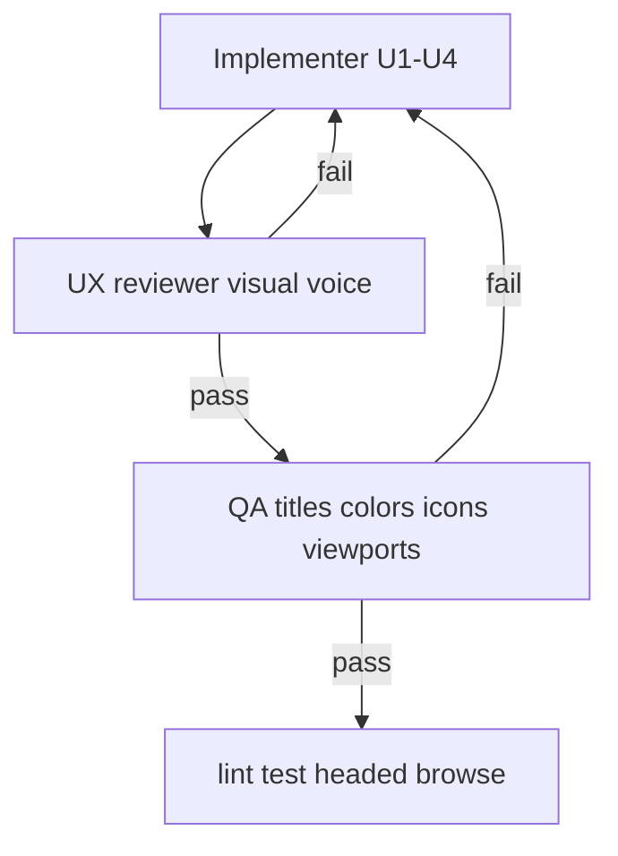

# Tracker chrome HUD, bike status, Cursor-grade icons - Plan

## Goal Capsule

- **Objective:** Make the browse/board chrome read as a mature instrument. Root titles are HUD labels. Bike counts warn by color. Six chrome icons share one technical drawing language.
- **Authority:** This plan. Session-settled product rules below win over older UX briefs. Do not change map rails, consists, or CTA keys.
- **Stop:** Leave the work if a change needs a new typeface, a copied Cursor glyph, or a map/feed edit.
- **Execution profile:** Implementer lands U1–U4. UX reviewer checks visual voice. QA checks titles, colors, icons, and both viewports. Then lint/test/headed browse.
- **Tail:** Remove dead CSS and unused emoji close/back after the SVG set lands.

Product Contract preservation: Product Contract created in this bootstrap. No upstream brainstorm file.

---

## Product Contract

### Summary

The map is already the product. This pass fixes the sheet and FAB chrome that still feel like a toy app. Titles shout like a consumer list. Bike status is one gray string. Icons are mixed emoji and generic strokes.

### Problem Frame

A rider opens browse to pick a mode. The title must look like CHI-TRON, not a blog header. A rider scanning Divvy needs to see empty racks and closed stations before they tap. FABs and close/back must look like one tool, not three libraries.

### Requirements

**Titles and alignment**

- R1. Root browse titles display as `TRAIN LINES`, `BUS ROUTES`, and `BIKE STATIONS`.
- R2. Search browse title displays as `SEARCH STATIONS`.
- R3. Station names, line names such as `Red Line`, and route names stay mixed case.
- R4. The browse title starts on the same left edge as the CHI-TRON wordmark text and uses HUD type (tracked, uppercase, mono or tracked Grotesk, secondary color).

**Bike status**

- R5. When `renting === false`, the list shows only `NOT RENTING` in `--status-bad`.
- R6. When renting, the list shows `N BIKES · M DOCKS` as two clauses.
- R7. `bikes = classic + ebikes > 0` uses `--status-ok` `#3bff6f`.
- R8. `bikes === 0` uses `--status-bad` `#ff3b4a`.
- R9. `docks > 0` uses `--tron-org` `#ff8c3c`.
- R10. `docks === 0` uses `--status-bad`.
- R11. The Divvy board uses the same colors for `NOT RENTING`, `DOCKS FULL`, bike counts, and dock counts.

**Maturity**

- R12. Sheet radius is 14px. Sheet motion has no 1.15 overshoot.
- R13. Kind tabs have no cyan halo. Active tab is a quiet white fill.
- R14. Line swatch glow is halved or removed. Tron brackets stay but at about 40% of current opacity.
- R15. Close and back controls use `--glass-radius-xs`, not pills.

**Icons**

- R16. Replace search, lines, locate, close, back, and row chevron with one 24px outline SVG family.
- R17. Stroke is 1.5px, round caps, round joins, `currentColor`, no fill, no cyan glow on the glyph.
- R18. Construction follows Cursor rules: H/V/45°, closed shapes, natural proportions, just enough round. Do not copy Cursor or Codicon paths.

### Actors

- A1. Phone rider using browse and FABs.
- A2. Implementer / UX reviewer / QA agents on this plan.

### Key Flows

- F1. Open browse from map
  - **Trigger:** List FAB.
  - **Outcome:** Title is `TRAIN LINES`, aligned to CHI-TRON. Icons match the FAB set.
- F2. Switch kind
  - **Trigger:** BUS or BIKE tab.
  - **Outcome:** Title becomes `BUS ROUTES` or `BIKE STATIONS`.
- F3. Scan bike list
  - **Trigger:** Bike list with mixed stock.
  - **Outcome:** Green/orange counts; zero and not-renting are red.
- F4. Open a Divvy board
  - **Trigger:** Tap a bike row.
  - **Outcome:** Board flags and stats use R5–R11.

### Acceptance Examples

- AE1. Covers R1, R4. Given browse open on train. Then title text is exactly `TRAIN LINES` and its left edge matches the wordmark text.
- AE2. Covers R5, R8, R10. Given a station with `renting: false`. Then meta is only `NOT RENTING` and red.
- AE3. Covers R6–R10. Given `classic+ebikes = 7` and `docks = 3`. Then `7 BIKES` is green and `3 DOCKS` is orange.
- AE4. Covers R16–R18. Given the three FABs and both close buttons. Then each contains an SVG with stroke 1.5 and no `✕` or `←` text.

### Success Criteria

A rider can name the surface from the title without reading the tabs. Empty bike stock is visible as a warning. The three FABs and sheet chrome look like one set.

### Scope Boundaries

In scope: `index.html` chrome CSS, `src/browse.js`, `src/dom.js`, `src/board.js`, new bike-meta helper + tests, six SVG marks.

Deferred: new typefaces, icon font, 16px/filled matrix, compass redraw, favicon.

Outside identity: map rails, consists, Divvy map dots, CTA keys, recoding line colors.

---

## Planning Contract

### Key Technical Decisions

- KTD1. HUD titles, not display headlines. `(session-settled: user-directed — chosen over title-case 16/700 Grotesk: user asked ALL CAPS aligned to the tracker)` Governs R1, R2, R4.
- KTD2. Split bike meta into tone nodes, not one string. `(session-settled: user-directed — chosen over a single gray meta line: user specified per-clause colors)` Governs R5–R11.
- KTD3. Six inline SVGs, not an icon font. `(session-settled: user-directed — chosen over copying Cursor glyphs or keeping emoji close/back: user asked Cursor rules, not assets)` Governs R16–R18.
- KTD4. Reuse `--glass-*` and `--tron-org`. Add only `--status-ok` and `--status-bad`. Governs R7–R15.
- KTD5. Execution uses three gates after code: implementer, UX reviewer, QA. User asked for this instead of Grok plan mode.

### High-Level Technical Design

### Assumptions

- Wordmark left pad stays 14px inside `safe-l`. Browse header uses the same inset.
- `bikes` is `classic + ebikes`. `docks` is free docks from the existing Divvy live object.
- Headed Chrome is required for screenshots. Headless MapLibre still dies in boot.

### Sequencing

U1 titles → U2 bike meta → U3 tokens → U4 icons. U2 can start after U1 strings exist. U4 last so close/back CSS is already squarer.

### Sources

- Session plan recovered from this conversation (Grok plan file was abandoned).
- Cursor craft: https://www.minoradventures.co/blog/the-making-of-cursors-icons
- Token brief: `docs/briefs/design-token-pass.md` (reuse glass tokens; headed screenshots only).

---

## Implementation Units

### U1. Root titles and tracker alignment

- **Goal:** Browse chrome titles match CHI-TRON.
- **Requirements:** R1, R2, R3, R4. KTD1.
- **Dependencies:** none
- **Files:** `src/browse.js`, `index.html`, `src/browse-titles.test.js`
- **Approach:**
  1. Export `ROOT_TITLES` for train, bus, bike, and search.
  2. Call `setTitle` with those constants at the four root/search sites.
  3. Leave `setTitle(line?.name)` mixed case.
  4. Style `#browse-title` as a HUD label. Match `#browse-header` left inset to wordmark text.
- **Patterns to follow:** `#wordmark` letter-spacing 0.16em, 13px, weight 600.
- **Test scenarios:**
  - Happy: `ROOT_TITLES.train === 'TRAIN LINES'` and the other three constants match R1–R2.
  - Edge: a station-list title is not forced through `toUpperCase`.
- **Verification:** Open browse. Title is `TRAIN LINES` and lines up with CHI-TRON.

### U2. Bike status color

- **Goal:** Bike list and board warn with the locked colors.
- **Requirements:** R5–R11. KTD2, KTD4.
- **Dependencies:** U1
- **Files:** `src/dom.js`, `src/browse.js`, `src/board.js`, `index.html`, `src/bike-status.test.js`
- **Approach:**
  1. Add `bikeStatusMeta(station)` returning `{ text, tone }[]`.
  2. Extend `browseRow` so `meta` may be a string or that array. String path stays for train/bus rows.
  3. CSS `.meta.is-ok`, `.is-bad`, `.is-dock`, `.is-dim`.
  4. Board: class `bike-flag` / `bike-stat-value` with the same tones.
- **Patterns to follow:** `src/dom.js` `browseRow` and `span()`.
- **Test scenarios:**
  - Happy: 7 bikes / 3 docks → ok + dock.
  - Edge: 0 bikes / 0 docks → two bad clauses.
  - Edge: `renting: false` → single `NOT RENTING` bad, no counts.
  - Integration: `browseRow` with string `meta` still emits one `.meta`.
  - Covers AE2. Covers AE3.
- **Verification:** Bike list and one Divvy board show the table in R5–R11.

### U3. Maturity tokens

- **Goal:** Quiet the candy chrome without a new design system.
- **Requirements:** R12–R15. KTD4.
- **Dependencies:** U1
- **Files:** `index.html`
- **Approach:**
  1. `--glass-radius: 14px`. Replace bounce ease.
  2. Kill `#browse-kind button.active` cyan box-shadow.
  3. Halve `.browse-swatch` / `.line-orb` glow.
  4. Dim `.tron-brackets`. Squarer close/back.
- **Patterns to follow:** existing `--glass-*` ladder in `docs/briefs/design-token-pass.md`.
- **Test expectation:** none -- token CSS only. Proof is headed screenshot vs current browse.
- **Verification:** Sheet looks flatter. Tabs do not glow cyan. Brackets are quieter.

### U4. Six chrome icons

- **Goal:** One hand-drawn outline set.
- **Requirements:** R16–R18. KTD3.
- **Dependencies:** U3
- **Files:** `index.html`, `src/dom.js` (chevron), `src/icons.test.js`
- **Approach:**
  1. Draw search, lines, locate, close X, back chevron on a 24 viewBox.
  2. Shared `.icon` stroke rules per R17.
  3. Swap FAB SVGs. Swap browse/sheet close and back. Swap `.browse-chevron`.
  4. Remove `✕` and `←` text.
- **Patterns to follow:** current `.fab-icon` sizing. Cursor essay rules, not paths.
- **Test scenarios:**
  - Happy: each of the three FABs contains `svg.fab-icon` or `svg.icon`.
  - Happy: `#browse-close` and `#sheet-close` contain an SVG and no `✕`.
  - Covers AE4.
- **Verification:** FABs and close/back read as one family at 390px and desktop.

---

## Verification Contract

| Gate | Who | Command / act | Pass |
|------|-----|---------------|------|
| Unit | Implementer | `npm test` | All existing tests plus new title/meta/icon tests green |
| Lint | Implementer | `npm run lint` | Clean |
| UX | UX reviewer | Headed browse at 1440 and 390 | R12–R18 visual voice. No childish bounce/halo. Icons one family |
| QA | QA | Headed flows F1–F4 | AE1–AE4. Board colors match list. No title wrap into close |
| Map regression | QA | Loop glance only | Rails and consists unchanged |

Headless browse is not proof of the map. It is allowed for sheet DOM only.

---

## Definition of Done

Global:

- R1–R18 are true in headed Chrome.
- `npm test` and `npm run lint` pass.
- UX gate and QA gate both pass after the last implementer fix.
- No Cursor/Codicon path data in the repo.
- No leftover emoji close/back.
- No map/consist/API files in the diff except if a test import requires them.

Per unit:

- U1: `ROOT_TITLES` tests pass. Screenshot of TRAIN LINES vs wordmark.
- U2: `bikeStatusMeta` three cases pass. Screenshot of mixed bike list + one board.
- U3: Before/after browse screenshot. No cyan tab halo.
- U4: Icon tests pass. FAB + close screenshot.

Abandoned icon drafts are deleted before done.
